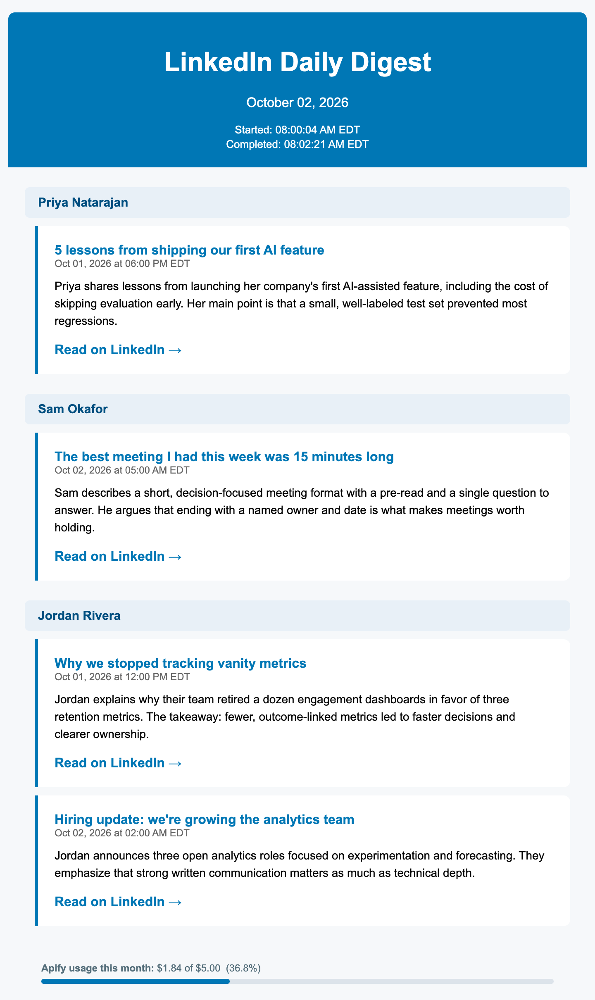

# LinkedIn Digest

A daily email digest of new LinkedIn posts from the people you choose, with a 2-sentence AI summary of each post. It runs on GitHub Actions, so you don't need a server.

<p align="center">
  
  <br>
  <em>Example digest (fictional authors and posts)</em>
</p>

Each run:

1. Scrapes the last 24 hours of posts from the profiles listed in `config/profiles.txt` with the [Apify](https://apify.com/) actor [`harvestapi/linkedin-profile-posts`](https://apify.com/harvestapi/linkedin-profile-posts).
2. Drops posts it has already emailed you, using `data/seen_posts.json`.
3. Summarizes each new post in 2 sentences with Google Gemini.
4. Emails an HTML and plain-text digest through Gmail, grouped by author, with your Apify credit usage at the bottom.
5. Commits the new post IDs back to the repo so tomorrow's run skips them.

If scraping or summarization fails, you still get an email that explains what went wrong.

> **Disclaimer:** This is an unofficial personal project, not affiliated with or endorsed by LinkedIn or Apify. Scraping is done by a third-party Apify actor. You're responsible for making sure your use complies with LinkedIn's User Agreement, Apify's terms, and the laws that apply to you. Only monitor public content.

---

## What you need

**You don't need to install anything.** The digest runs entirely on GitHub, and every setup step happens in your browser. It also never asks for your LinkedIn login.

You need 4 accounts:

| Account | Used for | Cost |
|---|---|---|
| GitHub | Runs the daily job, stores your keys | Free |
| [Apify](https://apify.com/) | Scrapes the posts | Pay per post |
| [Google AI Studio](https://aistudio.google.com/) | Gemini summaries | Free tier |
| Gmail or Google Workspace | Sends the digest | Free |

- **GitHub:** a run takes about 1-4 minutes for 30-odd profiles, well within GitHub's free Actions minutes for private repos.
- **Apify:** see the [actor's pricing](https://apify.com/harvestapi/linkedin-profile-posts). It fetches at most 2 posts per profile per day, so 30 profiles means at most 60 results a day, and usually fewer.
- **Gemini:** the free tier should be enough; the code stays under 10 requests a minute.
- **Gmail:** needs 2-Step Verification and App Passwords, which some work accounts block.

Apify is the only part likely to cost money. The digest can go to any email address; only the sending account has to be Gmail.

Installing software is only needed if you want to [run or change the code on your own computer](#running-locally-optional).

---

## Installation

### 1. Make your own copy

Click **Use this template → Create a new repository** at the top of this page. Making the copy **private** is recommended, because your profile list lives in the repo and each run commits the IDs of the posts it emailed you.

Forking also works and makes it easier to pull future updates, but forks of a public repo are always public, so anyone could see who you follow. GitHub disables Actions on new forks, so open your fork's **Actions** tab and click **I understand my workflows, go ahead and enable them**.

### 2. Get your API keys

1. **Apify token.** Sign up at [apify.com](https://apify.com/), then copy your API token from **Settings → API & Integrations**.
2. **Gemini key.** Go to [Google AI Studio](https://aistudio.google.com/), click **Get API key**, and create one.
3. **Gmail App Password.** Turn on [2-Step Verification](https://myaccount.google.com/signinoptions/twosv) for the Gmail account that will send the digest, then create an [App Password](https://myaccount.google.com/apppasswords). Copy the 16-character password **without spaces**. Don't use your normal Gmail password. If the App Passwords page says the setting isn't available, 2-Step Verification is off or your Google Workspace admin has blocked App Passwords.

### 3. Add the secrets to GitHub

In your copy, go to **Settings → Secrets and variables → Actions → New repository secret** and add these 5 secrets:

| Secret | Value |
|---|---|
| `APIFY_API_TOKEN` | Your Apify API token |
| `GEMINI_API_KEY` | Your Gemini API key |
| `GMAIL_ADDRESS` | The Gmail address that sends the digest |
| `GMAIL_APP_PASSWORD` | The 16-character App Password, no spaces |
| `RECIPIENT_EMAIL` | Where the digest goes (can be the same address) |

### 4. Choose who to follow

Replace the contents of `config/profiles.txt` with the profiles you want, one URL per line. Blank lines and lines starting with `#` are ignored, and only URLs containing `linkedin.com/in/` are loaded.

```text
# AI
https://www.linkedin.com/in/someprofile/

# Growth
https://www.linkedin.com/in/anotherprofile/
```

The easiest way is on GitHub: open `config/profiles.txt` in your copy, click the pencil icon, paste your list, and click **Commit changes**.

### 5. Run it once by hand

Go to **Actions → LinkedIn Digest → Run workflow**. The run takes a few minutes. When it finishes, check your inbox (and your spam folder the first time). If any new posts were found, a `chore: update seen post IDs` commit also appears in your copy.

### 6. Schedule the daily run

The workflow ships with only a manual trigger. Pick one way to run it every day.

**Option A: GitHub's built-in scheduler (simplest).** Add a `schedule` block to `.github/workflows/daily-linkedin-check.yml`:

```yaml
on:
  schedule:
    - cron: '0 12 * * *'  # 12:00 UTC = 8 AM EDT / 7 AM EST
  workflow_dispatch:
```

Cron times are in UTC. GitHub can start scheduled runs late during busy periods, and it disables schedules in public repos after 60 days without repository activity.

**Option B: an external scheduler (more punctual).** Have any cron service call GitHub's [workflow dispatch API](https://docs.github.com/en/rest/actions/workflows#create-a-workflow-dispatch-event) daily. Create a [fine-grained personal access token](https://github.com/settings/personal-access-tokens) scoped to your copy with **Actions: Read and write**, store it only in the scheduler, and have it send:

```bash
curl -X POST \
  -H "Authorization: Bearer <YOUR_TOKEN>" \
  -H "Accept: application/vnd.github+json" \
  https://api.github.com/repos/<OWNER>/<REPO>/actions/workflows/daily-linkedin-check.yml/dispatches \
  -d '{"ref":"<YOUR_DEFAULT_BRANCH>"}'
```

To pause the digest, go to **Actions → LinkedIn Digest**, click **⋯**, and choose **Disable workflow**.

---

## Running locally (optional)

Only needed if you want to change the code or test a change before pushing it. Running locally makes real API calls: it spends Apify credits, sends a real email, and updates `data/seen_posts.json`.

**Requirements:** [git](https://git-scm.com/downloads), plus either [uv](https://docs.astral.sh/uv/getting-started/installation/) (recommended) or Python 3.11+. uv downloads the right Python version for you if you don't have it.

```bash
git clone https://github.com/<OWNER>/<REPO>.git
cd <REPO>

# Fill in the same 5 values you added as GitHub secrets
cp .env.example .env

# With uv
uv sync
uv run --env-file .env python src/main.py
```

Without uv (macOS and Linux; on Windows, use the uv commands above):

```bash
python3 -m venv .venv
source .venv/bin/activate
pip install -r requirements.txt
set -a; source .env; set +a
python src/main.py
```

`.env` is already in `.gitignore`. Never commit it.

### Running the tests

The tests mock every external service, so they need no keys and cost nothing. The workflow runs them before every scrape.

```bash
# With uv
PYTHONPATH=src uv run python -m unittest discover -s tests -v

# Without uv, inside the activated virtual environment
PYTHONPATH=src python -m unittest discover -s tests -v
```

---

## Customizing

| To change | Edit |
|---|---|
| Who you follow | `config/profiles.txt` |
| Summary length or style | `SUMMARY_PROMPT_TEMPLATE` in `src/ai_summarizer.py` |
| Gemini model | `MODEL` in `src/ai_summarizer.py` ([available models](https://ai.google.dev/gemini-api/docs/models)) |
| Gemini rate limit | `REQUESTS_PER_MINUTE` and `MAX_WORKERS` in `src/ai_summarizer.py` |
| Posts fetched per profile | `maxPosts` in `scrape_profiles()` in `src/apify_scraper.py` (default 2, to keep Apify costs down) |
| Email design | The `<style>` block in `build_html_digest()`, plus the inline styles in the banner, notice, and footer helpers, in `src/email_sender.py` |
| Display time zone | `EASTERN` in `src/utils.py` (default `America/New_York`) |
| How many post IDs to remember | `MAX_SEEN_IDS` in `src/storage.py` (default 500) |
| Run time | The cron expression or your external scheduler (see step 6) |

---

## Getting updates

Template copies aren't linked to this repo, so updates don't reach yours on their own. To hear about new versions, click **Watch → Custom → Releases** on [the original repo](https://github.com/gsanders300/linkedin-digest). Each [release](https://github.com/gsanders300/linkedin-digest/releases) describes the change, and a compare link such as [`v1.0.1...v1.0.2`](https://github.com/gsanders300/linkedin-digest/compare/v1.0.1...v1.0.2) shows the exact file changes. Copy those changes into your copy by hand, and keep your own `config/profiles.txt`, `data/seen_posts.json`, and any files you customized.

If you forked instead, click **Sync fork** on your fork's main page.

---

## How it works

```
config/profiles.txt
        │  storage.load_profiles()
        ▼
apify_scraper.scrape_profiles()     1 Apify batch run for all profiles
        │
utils.filter_new_posts()            Keep posts from the last 24 hours
        │
dedup against data/seen_posts.json  Skip posts already emailed
        │
ai_summarizer.summarize_posts()     Gemini, ≤9 requests/min, retries with backoff
        │
email_sender.send_digest_email()    Gmail SMTP over SSL, retries transient failures
        │
storage.save_seen_ids()             Only after the scrape and email both succeed
        │
GitHub Actions commits data/seen_posts.json
```

Design choices worth knowing:

- **No database.** Deduplication state lives in `data/seen_posts.json`, which the workflow commits back after each successful run. It keeps the newest 500 IDs.
- **Nothing is marked seen unless the email sent.** If scraping or email delivery fails, the job exits non-zero, the failure shows up in GitHub Actions, and the posts can still go out on the next run if they're within the 24-hour window.
- **One Apify run per day.** All profiles go into a single batch job, capped at 2 posts per profile, which is cheaper than one run per profile.
- **Serialized runs.** A `concurrency` group stops a manual run and a scheduled run from double-sending or racing on the commit.

### Project layout

```
.
├── .github/workflows/daily-linkedin-check.yml   The digest workflow
├── .github/workflows/release.yml                Versions this repo's releases (does nothing in your copy)
├── config/profiles.txt                          Profiles to monitor
├── data/seen_posts.json                         Deduplication state (updated by CI)
├── docs/digest-example.png                      Example digest shown in this README
├── src/
│   ├── main.py                                  Entry point and pipeline
│   ├── apify_scraper.py                         Apify scrape and credit usage
│   ├── ai_summarizer.py                         Gemini summaries
│   ├── email_sender.py                          Digest builder and Gmail sender
│   ├── storage.py                               Profile list and seen-ID persistence
│   └── utils.py                                 Date and text helpers
├── tests/                                       Unit tests (unittest)
├── .env.example                                 Template for local secrets
├── pyproject.toml / uv.lock                     Dependencies for uv
└── requirements.txt                             Pinned dependencies for pip and CI
```

---

## Troubleshooting

| Symptom | Likely cause and fix |
|---|---|
| Email subject says **Scraper Error** | The banner in the email has the details. "Insufficient credits" means your Apify plan is used up for the month. |
| Email shows a **Summarization Warning** | Gemini failed for some posts, often because of rate limits or a bad key. Those posts show "Summary unavailable." |
| No email at all | Check the run log in the Actions tab. `Gmail authentication failed` means the App Password is wrong or 2-Step Verification is off. |
| Scheduled run never starts | Make sure Actions is enabled on your copy and the workflow has a `schedule` block (see step 6). |
| Same posts emailed twice | The **Persist seen post IDs** step couldn't push, so the post IDs weren't saved. Check that step's log; a branch protection rule or ruleset on your default branch is the usual cause. |

---

## License

[MIT](LICENSE)
